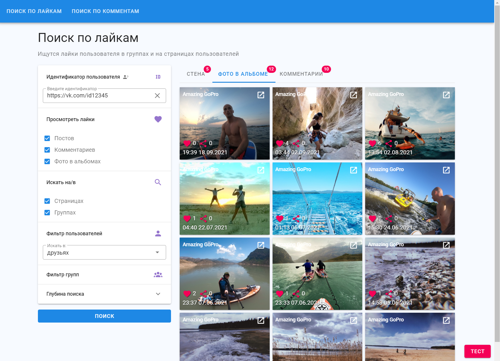
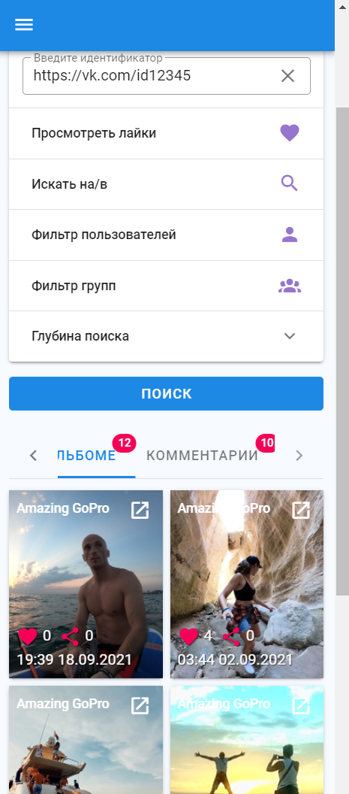

# About app
This app provides an opportunity to search for VK users likes.

There are many filters that allow you to search for a user's likes on:
- post
- comments
- Photos in photo albums

You can search in:
- groups (user groups, specified groups)
- user pages (in friends, subscribers, specified profiles)

Also you can choose the depth of your search.

My working progress you can see here: https://github.com/sob-alex/vk-activities/projects/1

if you have any suggestions and notes, go here: https://github.com/sob-alex/vk-activities/issues
## List of technologies used
* Vue
* Vuex
* Vue Router
* Vuetify
* Vuelidate
* Jest unit tests  
  

## Link of working app
https://sob-alex.github.io/vk-activities/
## Screenshots

### Mobile:

